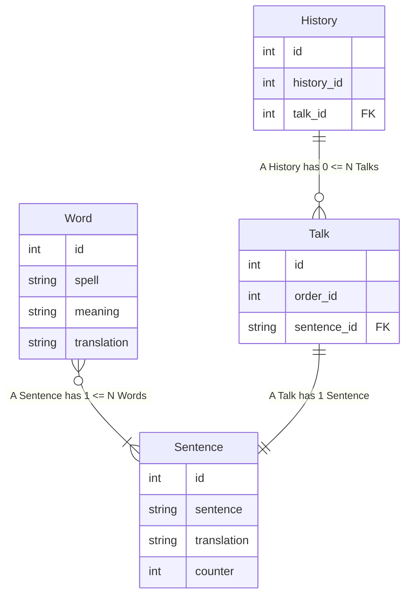

# English with ChatGPT

FastAPI + SQLAlchem + React + CHatGPT

GigaChadGPT 🗿🗿🗿

## Models

```mermaid
erDiagram
	Word {
		int id
		string spell
		string meaning
		string translation
	}

	Sentence {
		int id
		string sentence
		string translation
		int    counter
	}

	History {
		int id
		int history_id
		int talk_id    FK
	}

	Talk {
		int    id
		int    order_id
		string sentence_id FK
	}

	Word    }o--|{ Sentence : "A Sentence has 1 <= N Words"
	History ||--o{ Talk     : "A History has 0 <= N Talks"
	Talk    ||--|| Sentence : "A Talk has 1 Sentence"
```
